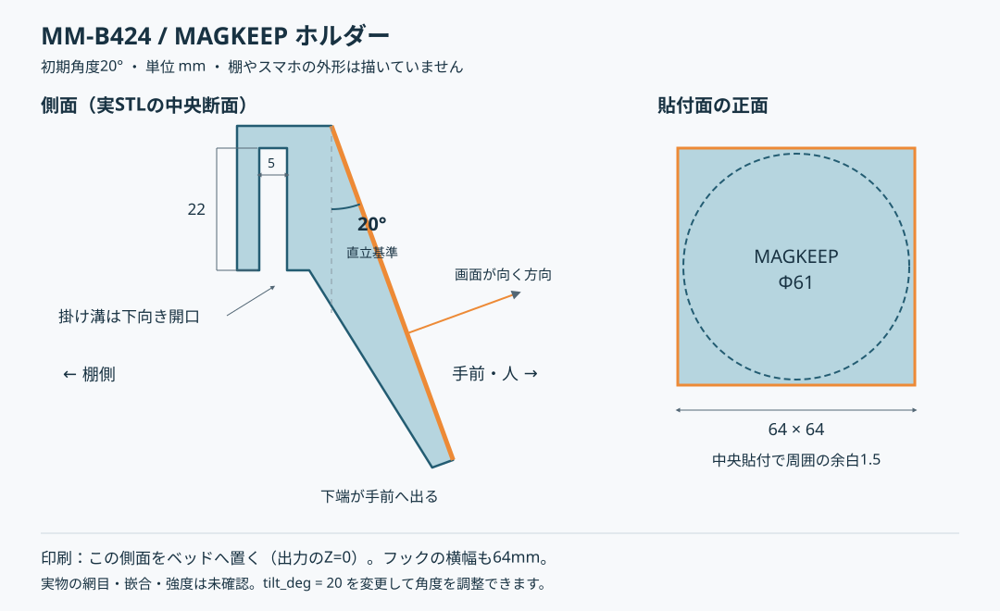

# MM-B424用MAGKEEPスマホホルダー

アイリスオーヤマのメタルミニ ブックシェルフMM-B424の棚の縁へ掛け、
Φ61mmのELECOM MAGKEEPを貼る一体型ホルダーです。スマホの画面を
直立から20度上向きにします。角度と掛け溝はOpenSCADで調整できます。



## 寸法と取付方向

| 箇所 | 初期値 |
| --- | --- |
| 平らな貼付面 | 64×64mm、中央Φ61mmの周囲に各1.5mmの余白 |
| 下向きに開く掛け溝 | 内寸5×22mm（奥行き×高さ）、追加すきまなし |
| フックの横幅 | 64mm（貼付面と同じ） |
| フックの壁・天井、貼付板の最小厚 | 4mm |
| 貼付面の傾斜 | 直立0度から上向き20度 |

溝を棚の手前の縁へ上から下ろして掛けます。貼付面の上端が棚側、下端が手前です。
MAGKEEPを平面の中央に貼り、その磁石へスマホを取り付けます。
フックと貼付面の間は一体のくさび状の肉でつながっています。

実物の嵌合・強度は未確認です。まず1個を試し刷りし、64mm幅のフックと棚の網目、
端末やカメラと棚の干渉を確認してください。タップ時のぐらつきやたわみ、
磁力と粘着面の保持、長時間の荷重による変形も確認し、使いやすい角度に調整します。

## 出力して印刷する

[リポジトリの導入手順](../../../README.md#stlを作る)に従い、OpenSCADを用意します。
以下はリポジトリのルートで実行します。

```sh
mkdir -p dist/steel-rack/mm-b424
openscad --export-format binstl \
  -o dist/steel-rack/mm-b424/magkeep_holder.stl \
  assets/steel-rack/mm-b424/magkeep_holder.scad
```

既定の`part="print"`は側面がZ=0にあり、そのままベッドへ置く向きです。
同じ断面を高さ64mmまで積むため、形状上はサポート不要です。出力の外形は
約38.89×61.51×64mmです。スライサーでベッド上へ配置し、必要ならブリムを使います。

scad-liveをこのリポジトリで起動している場合は、
`dist/steel-rack/mm-b424/magkeep_holder.3mf`が自動生成されます。
ビューアーとOrcaServerでは`steel-rack/mm-b424/magkeep_holder.3mf`を選びます。
本モデルは単色の`primary`です。材料指定は[共通規約](../../../docs/multi-material.md)を参照してください。

## 角度・嵌合を調整する

`magkeep_holder.scad`の先頭にある`tilt_deg`（初期20、範囲0〜45度）を変更すると、
フックを垂直に保ったまま貼付面だけを傾けられます。
掛け溝は`slit_width=5`と`slit_height=22`です。

例えば角度30度のSTLを別名で出力します。

```sh
openscad --export-format binstl -D 'tilt_deg=30' \
  -o dist/steel-rack/mm-b424/magkeep_holder_30.stl \
  assets/steel-rack/mm-b424/magkeep_holder.scad
```

OpenSCADで`part="mounted"`にすると取付姿勢を表示します。
Xが左右、+Yが手前、+Zが上です。この表示姿勢は印刷用ではありません。
上の側面図は初期20度の形状です。変更後はOpenSCADで形状と干渉を確認します。
